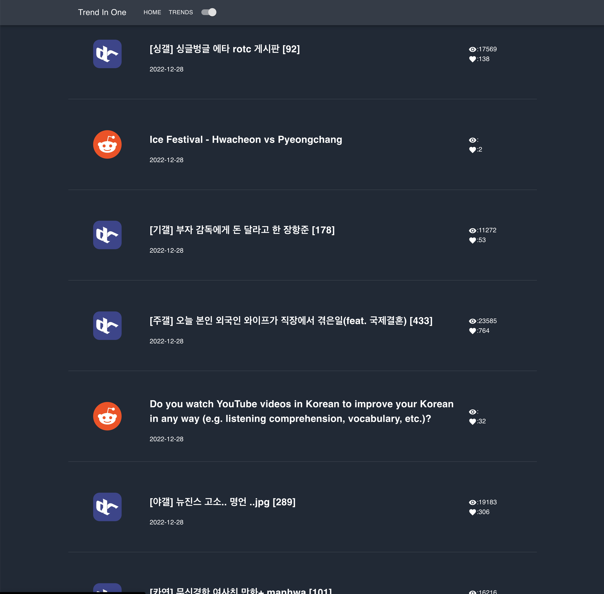
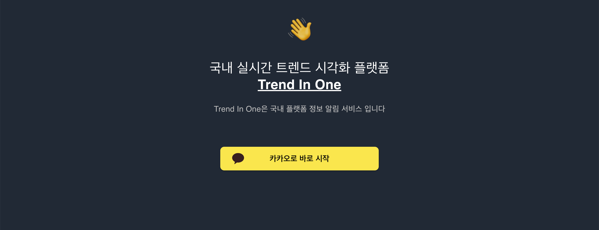

 

  <h1 align="center">Trend In One Front-End</h3>

  

    
     
     
    <strong>Skill: Typescript, React, Material-UI, Emotion, Jotai, React-Query	</strong>

  

 
 

## About The Project

여러 사이트의 게시글을 크롤링 / OPEN API를 이용함으로써 한 눈에 글로벌 트렌드를 확인 할 수 있는 가치를 제공합니다.

### 

- 레딧, dcinside, 4chan 등의 각 국의 사용자가 많은 커뮤니티의 인기 포스트를 수집
- 실시간 인기 포스트 제공
- 본인의 관심사 필터링
- 특정 기준을 통한 인기글 정렬
- 특정 커뮤니티 인기글 보기
 

### Front View

  

  

